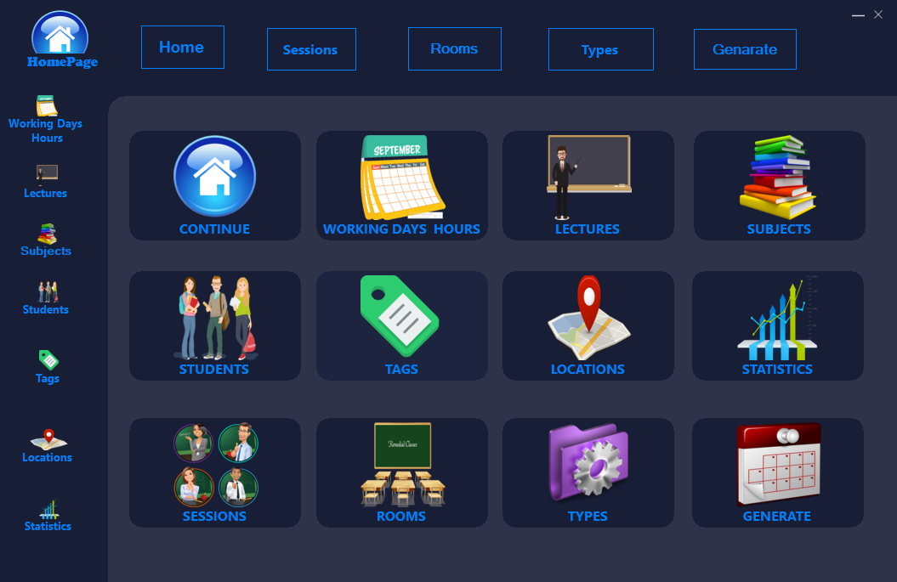

# Timetable Management System
ABC is a leading non-state degree awarding institute. Assume Our group is working in the IT division of the ABC institute. They have been asked to develop a desktop application for managing the timetables of the ABC institute. 

# Technologies
  * C#
  * .Net Framework
  * Azure DB

# Link to Setup File
https://github.com/kulanaavinash/Timetable-Management-System/commit/9421efa84d76b068fdb5cb466b41a77a6a7ca4c1

# Link to Project Specification
https://github.com/kulanaavinash/Timetable-Management-System/blob/38b090919ba672510c2e9832b9a622be2720c628/Project%20Specification/Project%20Specification.pdf

# Sample Screenshot of the UI  

<h1>Home</h1>

# Developers

  - [Kulana Avinash] (https://github.com/kulanaavinash)       : Member 1
  - [Chethika Dithmal] (https://github.com/chethika)          : Member 4
  - [Nipuna Kaushan] (https://github.com/nipunakaushan)       : Member 2
  - [Pathum Wijerathne] (https://github.com/PathumSrimal)     : Member 3

